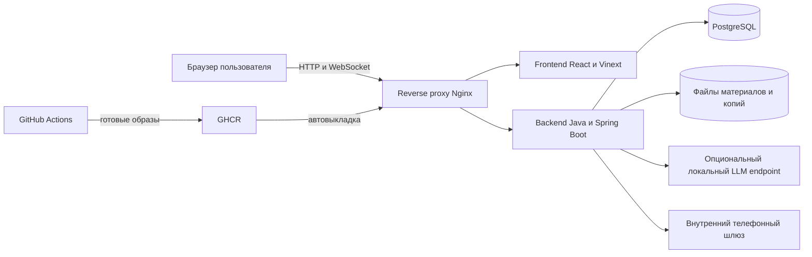

# Сопроводительная документация учебного тренажёра АРМ 112

**Архитектура, методы обработки данных, сборка, установка, эксплуатация и ограничения**

Версия документа: 1.0

Состояние продукта: контракт API 0.3.16

Дата: 29 сентября 2026 года

Репозиторий: <https://github.com/Dema-koder/lct2026-arm112>

> Статус: первая полная редакция для передачи на техническую экспертизу. Поля о владельце системы, согласующих лицах, доменном имени и промышленном SIP-шлюзе заполняются после организационного решения.

## 1 Назначение документа

Документ описывает фактически реализованную версию учебного тренажёра АРМ 112 и предназначен для:

- технических экспертов и приёмочной комиссии;
- администратора стенда;
- разработчиков frontend и backend;
- преподавателей, готовящих учебные занятия;
- специалистов по информационной безопасности и эксплуатации.

Документ закрывает обязательные пункты технического задания о методах обработки данных, условиях и ограничениях, сборке и установке, функциональной и компонентной архитектуре, открытости исходного кода и используемых библиотеках.

Инструкция фиксирует состояние исходного кода на дату документа. При расхождении с кодом первичны OpenAPI-контракт и конфигурация соответствующего релиза.

## 2 Комплект поставки

| Артефакт | Расположение | Назначение |
|---|---|---|
| Исходный код | <https://github.com/Dema-koder/lct2026-arm112> | Frontend, backend, миграции БД, тесты, контейнеризация и CI/CD |
| API-контракт | `docs/contracts/openapi.yaml` | Независимая разработка и интеграция frontend и backend |
| Настоящий документ | `docs/PROJECT_DOCUMENTATION.md`, `docs/deliverables/ARM112_Project_Documentation.docx`, `.pdf` | Сопроводительная документация по ТЗ |
| Инструкция по production | `docs/DEPLOYMENT.md` | CI/CD, сервер, диагностика, телефония |
| Инструкция по локальному запуску | `docs/POSTGRES_DOCKER.md` | Docker Compose, PostgreSQL, Swagger |
| Руководство по ролям | `docs/TESTING_ROLES.md` | Ручная проверка интерфейсов трёх ролей |
| План испытаний | `docs/TEST_PLAN.md` | Регрессия, безопасность, резервные копии и smoke-проверка |
| Методы оценки | `docs/assessment/ASSESSMENT_AND_SCENARIOS.md` | Критерии, веса, замечания и сценарии |
| Нагрузочный профиль | `docs/assessment/LOAD_PROFILE.md` | Результаты испытания 20–100 пользователей |
| Презентация | **Заполнить перед сдачей** | Ссылка на презентацию решения |
| Интерактивный прототип | `http://103.112.71.71` | Текущий демонстрационный стенд; до настройки TLS использует HTTP |

## 3 Назначение и границы системы

### 3.1 Назначение

АРМ 112 — локальный учебный тренажёр для отработки действий оператора системы 112 и диспетчера дежурно-диспетчерской службы. Система воспроизводит поток обращений и карточек происшествий, измеряет действия обучающегося и даёт преподавателю средства подготовки, контроля и разбора занятий.

### 3.2 Роли

| Роль | Основные задачи | Область доступа |
|---|---|---|
| Обучающийся | Принять вызов, заполнить карточку, обработать карточку ДДС, выполнить доклад, посмотреть результаты и материалы | Собственная активная сессия, собственные результаты и материалы своей группы |
| Преподаватель | Создать сценарий и занятие, выбрать участников, наблюдать занятие, завершить его, скорректировать оценку, опубликовать результат, смотреть аналитику | Свои группы, занятия, сценарии и обучающиеся |
| Администратор | Управлять пользователями и группами, настройками, сервисами, калибровкой оценки, аудитом, логами и резервными копиями | Системные функции и все учётные записи |

Роли проверяются сервером. Скрытие кнопки во frontend не является средством разграничения доступа.

### 3.3 Режимы занятия

- `CARD_FILL` — обучающийся работает как оператор 112: принимает входящий вызов, уточняет сведения и сохраняет карточку.
- `CARD_ACTIONS` — обучающийся работает как диспетчер ДДС: принимает или отклоняет карточку, ведёт статусы реагирования, комментарии и обязательный исходящий доклад.

Виды занятия:

- тренировка — доступны подсказки, результат виден после завершения;
- проверка — без учебных подсказок, результат виден после завершения;
- зачёт — результат скрыт до публикации преподавателем.

Интенсивность `SEQUENTIAL`, `LOW`, `MEDIUM` или `HIGH` определяет интервалы поступления и число фоновых карточек. Новые события могут приходить во время обработки предыдущего, поэтому сессия не является линейным мастером шагов.

### 3.4 Принципиальные ограничения области

Система предназначена только для обучения. Она:

- не принимает реальные экстренные вызовы граждан;
- не заменяет промышленный комплекс 112 и рабочее место оператора;
- не отправляет карточки реальным экстренным службам;
- не должна содержать реальные персональные, служебные или конфиденциальные данные;
- не используется для принятия оперативных решений;
- не предоставляет Telegram-уведомления; аварийное оповещение допускается только через внутренний телефонный шлюз организации.

## 4 Функциональная архитектура

### 4.1 Функциональные модули

| Модуль | Возможности |
|---|---|
| Авторизация | Вход, короткоживущий access JWT, refresh-токен, выход, немедленный отзыв после блокировки или смены прав |
| Рабочее место обучающегося | Журнал, вызовы, карточки, статусы, телефония-симуляция, результаты, рейтинг и материалы |
| Рабочее место преподавателя | Сценарии, занятия, монитор, отчёт, оценка, публикация, материалы и аналитика |
| Рабочее место администратора | Пользователи, группы и состав, сервисы, телефонный шлюз, коррекция ИИ, настройки, аудит, система и копии |
| Движок симуляции | Персональные сессии, независимый поток вводных, таймеры, параллельные статусы служб, восстановление состояния |
| Оценивание | Детерминированные критерии, замечания, рекомендации, оценка преподавателя и итог |
| Аналитика | Динамика обучающегося, слабые места, портфель занятий, срезы по группе и участнику |
| Фоновые задания | Очередь персонального разбора и длительных операций вне основного запроса |
| Эксплуатация | Health check, Prometheus, журнал событий, резервное копирование и восстановление |

### 4.2 Жизненный цикл занятия

1. Преподаватель выбирает режим, вид, интенсивность, сценарии и участников.
2. После старта backend создаёт персональную сессию каждому участнику.
3. Движок выдаёт вводные по расписанию, независимо от текущей открытой карточки.
4. Действия обучающегося сохраняются в PostgreSQL и публикуются адресными WebSocket-событиями.
5. При завершении сессии сервер рассчитывает исходную оценку и сохраняет подробные критерии и замечания.
6. Детерминированные рекомендации доступны сразу. Персональный текст языковой модели, если модель подключена, формируется в фоне.
7. Преподаватель может принять оценку или задать свои баллы по критериям и комментарий.
8. В зачёте преподаватель отдельно публикует результат.
9. Итог попадает в результаты, рейтинг, аналитику и отчёт занятия.

### 4.3 Сценарии

Поддерживаются источники:

- `TICKET` — сценарии из подготовленных учебных билетов;
- `GENERATED` — сценарии, сформированные преподавателем;
- `TRAINEE_MADE` — корректно сохранённые карточки обучающихся, разрешённые для повторного использования.

Сценарий хранит эталон адреса, типов происшествия, служб, ожидаемого решения ДДС и признака обязательного доклада. Перед применением преподаватель отвечает за содержательную проверку эталона.

Категория сценария — позиция списка «Что случилось?» (например «101 — Пожар», «ДТП», «Человек в опасности»), выведенная из раздела ЕКП его главного типа; сервер вычисляет её сам. Эталоны 96 билетов размечены вручную (`docs/materials/data/scenario-overrides.json`); при старте неподтверждённые эталоны обновляются из поставки, подтверждённые преподавателем не меняются.

Сгенерированные сценарии берутся из двух источников: банк из 28 сценариев, написанных заранее и проверенных, и генерация по запросу преподавателя в выбранной категории. Генерация идёт фоновой задачей: текст вводной пишет локальная языковая модель, адрес и тип берутся из проверенной основы, каждый кандидат проходит проверку справочниками, отсеянные добираются до заказанного числа. Без модели новые сценарии не создаются — система так и сообщает. Всё сгенерированное попадает в библиотеку с неподтверждённым эталоном. Подробно — `docs/assessment/ASSESSMENT_AND_SCENARIOS.md` §7.

## 5 Компонентная архитектура



### 5.1 Состав компонентов

| Компонент | Технология | Ответственность | Состояние |
|---|---|---|---|
| Frontend | React 19, Vinext, TypeScript | Интерфейсы ролей, клиент API и WebSocket | Реализован |
| Backend API | Java 21, Spring Boot 4 | Бизнес-правила, RBAC, оценивание, симуляция, аналитика | Реализован |
| PostgreSQL | PostgreSQL 17, минимум по ТЗ 12+ | Транзакционные данные, сессии, оценки, аудит, очередь | Реализован |
| Reverse proxy | Nginx 1.29 | Единая точка входа и маршрутизация | Реализован; TLS ещё не настроен |
| Доставка событий | WebSocket плюс журнал последовательностей | Живые обновления и дочитывание после разрыва | Реализована |
| Фоновые задания | Таблица `job` и worker backend | Отложенный персональный разбор | Реализованы |
| Телефония | Локальные аудиосигналы и HTTP-контракт шлюза | Учебные вызовы и аварийное голосовое оповещение | Mock реализован; настоящий шлюз не подключён |
| Языковая модель | OpenAI-совместимый локальный HTTP endpoint | Дополнительный персональный разбор | Опциональна; без неё система работает |
| CI/CD | GitHub Actions, GHCR, Docker Compose | Тесты, образы, выкладка и откат | Реализован |

### 5.2 Протоколы и интерфейсы

- REST API: `/api/v1`, контракт OpenAPI 3.1 в `docs/contracts/openapi.yaml`.
- Realtime: `/ws/v1`; одноразовый ticket действует 30 секунд.
- Восстановление после разрыва: события с номером последовательности читаются REST-запросом после последнего принятого номера.
- Health: `/actuator/health`; метрики Prometheus: `/actuator/prometheus`.
- Swagger: `/swagger-ui.html`; в production доступ требует роли администратора и обычно проверяется локально.
- Телефонный шлюз: внутренний HTTP API с Bearer-токеном и защищённым callback.

### 5.3 Данные и хранилища

Основные сущности: пользователь, группа, занятие, учебная сессия, сценарий, состояние тренировки, realtime-событие, оценка, замечание, карточка оценки, персональный разбор, материал, аудит, фоновая задача, версия калибровки и попытка аварийного звонка.

Структура БД управляется Flyway-миграциями `V1`–`V21`. Ручное изменение схемы production-базы не допускается.

Файлы материалов, логи и ZIP-копии находятся в отдельном Docker volume backend. Копии могут дополнительно записываться во внешний каталог.

## 6 Методы обработки данных

### 6.1 Общие принципы

Основная оценка воспроизводима: одинаковый снимок сессии и одинаковая версия правил дают одинаковый результат. В интерфейсе термин «ИИ» используется для понятного разделения автоматической и преподавательской оценки, но базовая оценка выполняется детерминированными алгоритмами, а не генеративной моделью.

Исходная автоматическая оценка сохраняется отдельно. Оценка преподавателя имеет приоритет для итогов, но не затирает исходные данные. Уже завершённые занятия при включении новой калибровки не пересчитываются.

### 6.2 Оценка режима заполнения карточки

| Критерий | Вес | Метод |
|---|---:|---|
| Адрес | 40 | Нормализация, сравнение частей адреса, расстояние Левенштейна и штрафы за пропуски или несовпадения |
| Классификация | 20 | Тип выводится из позиции «Что случилось?» и ответов опросной карты. Совпавший тип — 1, неверный тип из той же позиции (раздела ЕКП) — 0,5; сумма делится на число различных типов в выборе и эталоне |
| Службы | 20 | Доля совпадения назначенных и ожидаемых служб. Службы подставляются по матрице ЕКП от выбранного типа, поэтому неверный тип снижает и этот критерий |
| Время | 15 | Линейный штраф после норматива 180 секунд плюс штраф за пропущенные и потерянные вызовы |
| Грамотность | 5 | Локальный LanguageTool и правила небрежного набора без отправки текста наружу; −15 за находку. Не считаются ошибкой ФИО и имена собственные, названия улиц из сценариев, сокращения служб |

Адрес приводится к нижнему регистру, `ё` заменяется на `е`, служебные слова и пунктуация нормализуются. Ошибка в улице является критичной; номер дома и дополнительные элементы дают отдельные замечания.

### 6.3 Оценка режима действий с карточкой

| Критерий | Вес | Метод |
|---|---:|---|
| Время | 30 | Просрочка принятия и обработки по серверным таймерам |
| Действия | 40 | Проверка терминального статуса, компетенции, отказов, выезда и обязательного доклада |
| Коммуникация | 15 | Наличие содержательного основания или результата в комментариях |
| Грамотность | 15 | Локальная проверка всех комментариев карточки |

Норматив принятия считается с момента появления карточки в журнале, а не с момента открытия. Это позволяет учитывать время, которое обучающийся потратил на обнаружение и открытие карточки.

### 6.4 Рекомендации и персональный разбор

Для каждого кода замечания сервер сразу выдаёт детерминированную рекомендацию. Повторяющиеся замечания одного типа агрегируются. Критичные проблемы выводятся первыми.

Отдельный текстовый разбор может формироваться локальной языковой моделью через настраиваемый endpoint. Первое предложение каждого пункта — факт об ошибке — формулирует сервер («вы записали «…», правильно — «…»»); модель дописывает к нему одно предложение о последствиях и о том, как отработать. Факт вписан в грамматику ответа дословно, поэтому модель не может его исказить. Пункт с числом или цитатой, которых нет в данных оценки, отбрасывается; текст проходит проверку языка. Состояния:

- `PENDING` — задача ещё обрабатывается;
- `READY` — текст модели готов;
- `UNAVAILABLE` — модель не настроена, недоступна или текст отклонён проверками.

Система не подменяет отсутствующий текст модели автоматическими правилами: пользователь видит честный статус. При отключённой модели основная оценка и рекомендации работают полностью.

Ограничение: очередь обрабатывает персональные разборы последовательно, около 50 секунд на человека на модели 7B без видеокарты (замер 29.09: три разбора за 61–152 секунды); для класса из 30 человек — порядка 25 минут. Разбор не использует историю прошлых занятий.

### 6.5 Коррекция автоматической оценки

Администратор может активировать версию калибровки, построенную по явным баллам преподавателей. Для каждого критерия применяется линейная модель:

`балл преподавателя ≈ a × балл автоматической оценки + b`.

Условия безопасности:

- не менее 30 пар оценок по критерию;
- обучение и проверка разделены: каждая пятая пара образует отложенную выборку;
- версия предлагается только при достаточном улучшении средней абсолютной ошибки;
- критерии с малым разбросом или незначительным расхождением пропускаются;
- включение выполняется администратором вручную;
- версия влияет только на будущие оценки;
- исходный балл, коэффициенты и номер версии сохраняются для аудита.

Это статистическая калибровка, а не дообучение весов языковой или нейросетевой модели.

**Пороги** (`CalibrationService`):

| Условие | Значение | Что происходит, если не выполнено |
|---|---|---|
| Пар «балл системы — балл преподавателя» по критерию | не меньше 30 | критерий пропускается с причиной «пар N из 30» |
| Средняя ошибка системы до коррекции | не меньше 3 баллов | критерий пропускается: расхождение в пределах шума |
| Снижение ошибки на отложенных парах | не меньше 10 % | версия по критерию не предлагается |
| Наклон `a` | от 0,2 до 3 | поправка отбрасывается как неправдоподобная |

Обучающая пара — работа, по которой преподаватель задал балл по критерию или явно согласился с баллом системы (кнопка «Согласен с оценкой ИИ» в разборе сессии). Для обучения берётся исходный балл системы, а не уже скорректированный, поэтому поправка не усиливает сама себя.

**Как пользоваться.**
1. Преподаватели в разборе занятия ставят баллы по критериям или подтверждают баллы системы — по каждому критерию нужно не меньше 30 таких работ.
2. Администратор открывает раздел «Коррекция ИИ», выбирает режим (заполнение карточки или действия диспетчера) и видит кандидата: коэффициенты по критериям, ошибку до и после на отложенных парах, причины пропуска критериев.
3. Администратор включает версию с подтверждением. Её можно отключить там же, история версий сохраняется.

API: `GET /admin/assessment-calibration`, `POST …/activate`, `POST …/deactivate`.

**Второй механизм подстройки — подсказка типа.** Когда преподаватель подтверждает эталон сценария, слова его вводной добавляются к признакам эталонного типа в подсказке «По словам заявителя похоже на…» (`IncidentTypeClassifier.learn`, вес 0,5 против 1,0 у синонимов справочника). На баллы это не влияет.

### 6.6 Аналитика

Аналитика агрегирует только доступные роли данные:

- обучающийся видит собственную динамику, средний балл, место в группе, режимы, виды занятий, слабые критерии и повторяющиеся замечания;
- преподаватель фильтрует занятия по занятию, группе и обучающемуся, видит портфель состояний, средние итоги и участников ниже порога 70;
- администратор видит технические метрики, аудит и состояние калибровки.

Агрегации строятся по сохранённым оценкам PostgreSQL. Генеративный текст не используется как источник статистики; повторяемость определяется по стабильным кодам замечаний.

### 6.7 Языковая модель: где участвует

Модель используется в двух местах и не участвует в выставлении баллов:

| Где | Что пишет модель | Что задаёт код | Защита |
|---|---|---|---|
| Генерация сценария | Только текст заявителя по заданному типу и месту | Адрес, тип, службы, категория — из проверенной основы | Грамматика (только кириллица), проверка справочниками, эталон всегда неподтверждён |
| Персональный разбор | Одно предложение о последствиях к каждому факту | Факты об ошибках, их порядок и число | Факт вписан дословно, отсев выдуманных чисел и цитат, проверка языка |

Модель по умолчанию — Qwen2.5-7B-Instruct Q4 через сайдкар `llama.cpp` (`compose.llm.yaml`, веса в `./models`). Выбрана по замеру пяти моделей на целевом железе без видеокарты: 100 % годных сценариев против 83 % у Saiga-Llama3-8B; 12B в память не поместилась (`docs/assessment/LLM_EXPERIMENT.md` §4д). Без модели система работает полностью: оценка и рекомендации по правилам не меняются, разбор получает статус `UNAVAILABLE`, генерация сообщает, что модель не подключена.

### 6.8 Персональные данные

Для демонстрации применяются вымышленные ФИО, адреса и телефоны. Запрещается загружать реальные обращения, записи разговоров, персональные данные заявителей и сведения ограниченного доступа. Перед импортом учебного набора владелец данных обязан выполнить обезличивание.

## 7 Информационная безопасность

### 7.1 Реализованные меры

- пароли хешируются BCrypt;
- серверная ролевая модель `ADMIN`, `TEACHER`, `TRAINEE`;
- access JWT содержит версию авторизации и немедленно становится недействительным после блокировки, смены роли, профиля или пароля;
- refresh-токены ротируются и хранятся сервером;
- попытки входа ограничиваются и очищаются по расписанию;
- CORS принимает только заданные origins;
- изменяющие запросы фиксируются в аудите;
- Swagger и Prometheus в production закрыты ролью администратора;
- секреты передаются через `.env` и GitHub Secrets, а не хранятся в репозитории;
- контейнер backend работает от непривилегированного пользователя;
- контейнеры имеют лимиты памяти, процессов, health check и ротацию Docker-логов;
- команды поддерживают идемпотентность, а состояние сессии — optimistic locking;
- CSV-выгрузка защищена от формул и управляющих символов.

### 7.2 Невыполненные меры перед промышленной эксплуатацией

Текущий публичный стенд работает по HTTP, поскольку доменное имя и сертификат не предоставлены. Это не соответствует требованию ТЗ о TLS. До работы вне закрытого демонстрационного контура необходимо:

1. назначить доменное имя;
2. установить сертификат организации или доверенного УЦ;
3. включить HTTPS в reverse proxy и перенаправление HTTP на HTTPS;
4. заменить origins и WebSocket URL на `https` и `wss`;
5. повторить проверку авторизации и realtime-соединений.

Лог-файл приложения хранит 30 ротированных файлов, а Docker — три файла по 10 МБ. Требование хранения значимых событий не менее шести месяцев выполняется для аудита в БД при настройке срока не менее 180 дней, но для технических логов нужен внешний журнал или архив с политикой 180+ дней.

### 7.3 Управление секретами

В документацию, Git и скриншоты запрещено помещать реальные пароли, JWT-ключи, токены телефонного шлюза и приватные SSH-ключи. После первого запуска сидовые пароли необходимо заменить. Файл production `.env` должен иметь права `600` и храниться только на сервере.

## 8 Требования к окружению

### 8.1 Рекомендуемый способ

- Linux x86_64 с Docker Engine 27+ и Docker Compose v2;
- 2 vCPU, 4 ГБ RAM и 40 ГБ SSD для учебного класса и запаса под копии;
- отдельный диск или NFS для внешних резервных копий;
- актуальный Chrome, Edge или Firefox на Windows 10/11 и Linux;
- доступ к GHCR и Maven/npm только для сборочного контура;
- для необязательной языковой модели — дополнительно около 6 ГБ RAM и 5 ГБ диска (раздел 10.5).

Лимиты памяти контейнеров в `compose.production.yaml`: backend 1 ГБ, PostgreSQL 512 МБ, frontend 512 МБ, proxy 128 МБ — всего около 2,2 ГБ. Backend в работе занимает около 530 МБ (LanguageTool держит пул словарей), поэтому прежний лимит 384 МБ не годился. Минимум без языковой модели — 2 vCPU и 4 ГБ RAM; с моделью Qwen2.5-7B Q4 (`compose.llm.yaml`, около 3–5 ГБ) — 4+ vCPU и 8+ ГБ RAM, 20 ГБ диска. Текущий стенд: 31 ГБ RAM.

### 8.2 Инструменты для сборки без Docker

- JDK 21;
- Maven 3.9+;
- Node.js 22.13+ или 24+;
- npm из выбранной версии Node.js;
- PostgreSQL 12+; в штатных compose-файлах используется PostgreSQL 17.

## 9 Сборка и проверка исходного кода

### 9.1 Получение кода

```bash
git clone https://github.com/Dema-koder/lct2026-arm112.git
cd lct2026-arm112
```

### 9.2 Backend

```bash
mvn clean verify
```

Команда компилирует Java 21, запускает модульные и интеграционные тесты и собирает `target/arm112-backend-*.jar`.

Запуск собранного приложения без Docker требует доступной PostgreSQL и переменных подключения:

```bash
export SPRING_DATASOURCE_URL=jdbc:postgresql://localhost:5432/arm112
export SPRING_DATASOURCE_USERNAME=arm112
export SPRING_DATASOURCE_PASSWORD='<пароль>'
export ARM112_JWT_SECRET='<случайный секрет не короче 32 байт>'
java -jar target/arm112-backend-0.1.0-SNAPSHOT.jar
```

### 9.3 Frontend

```bash
cd frontend
npm ci
npm run lint
npm test
```

`npm test` создаёт production bundle и проверяет ключевой HTML. Для отдельной сборки используется `npm run build`, для запуска собранного приложения — `npm run start`.

### 9.4 Docker-образы

```bash
docker build -t arm112-backend:local .
docker build -t arm112-frontend:local ./frontend
```

Backend собирается в Maven-образе и запускается на Eclipse Temurin 21 JRE Alpine. Frontend собирается и запускается на Node 22 Alpine.

## 10 Локальная установка

### 10.1 Подготовка

```bash
cp .env.example .env
```

Для локальной демонстрации значения по умолчанию допустимы. Для общего стенда обязательно заменить пароли и JWT-секрет.

### 10.2 Запуск

```bash
docker compose up --build -d
docker compose ps
```

После успешного health check доступны:

- frontend: <http://localhost:3000>;
- backend API: <http://localhost:8080/api/v1>;
- Swagger: <http://localhost:8080/swagger-ui.html>;
- health: <http://localhost:8080/actuator/health>;
- PostgreSQL: `localhost:55432`.

Локальный compose также запускает mock телефонного шлюза. Его сценарий и задержку можно менять в интерфейсе администратора.

### 10.3 Первый вход

На пустой базе создаются учётные записи `admin`, `teacher`, `trainee`. Пароли задаются переменными `ARM112_SEED_ADMIN_PASSWORD`, `ARM112_SEED_TEACHER_PASSWORD`, `ARM112_SEED_TRAINEE_PASSWORD`. Значения по умолчанию предназначены только для локального стенда.

### 10.4 Остановка

```bash
docker compose down
```

Данные сохраняются в volumes. Команда `docker compose down -v` удаляет БД и материалы и допустима только для сознательного сброса тестового стенда.

### 10.5 Подключение языковой модели (необязательно)

Модель нужна для двух функций: генерации новых сценариев и персонального разбора занятия (раздел 6.7). Баллы, замечания и рекомендации считаются правилами и от неё не зависят. Без модели система работает полностью: окно генерации сообщает, что модель не подключена, а у разбора вместо текста — пояснение, что он не составлен.

Обычный `docker compose up` модель не запускает. Она подключается вторым файлом `compose.llm.yaml`, а веса скачиваются отдельно: в образы и в репозиторий они не входят (каталог `models/` в `.gitignore`).

**Что нужно**

| Ресурс | Значение |
|---|---|
| Файл весов | Qwen2.5-7B-Instruct, квантование Q4_K_M, один файл 4,68 ГБ |
| Оперативная память | около 6 ГБ под модель сверх потребностей приложения; замеры проводились при 13 ГиБ памяти Docker |
| Процессор | видеокарта не нужна; замеры — на 12 ядрах: около 10 с на сценарий, 1–2 минуты на разбор одного обучающегося |
| Диск | около 5 ГБ под файл весов |
| Сеть | только для разовой загрузки файла весов и образа `ghcr.io/ggml-org/llama.cpp:server` |

На Windows память контейнеров ограничивает Docker Desktop (WSL 2): если ему выделено меньше 8 ГБ, модель может не загрузиться.

**Шаг 1. Скачать веса**

Источник — репозиторий [`bartowski/Qwen2.5-7B-Instruct-GGUF`](https://huggingface.co/bartowski/Qwen2.5-7B-Instruct-GGUF) на Hugging Face, файл `Qwen2.5-7B-Instruct-Q4_K_M.gguf`. Этот файл использовался во всех замерах (`docs/assessment/LLM_EXPERIMENT.md`). Сохранить его нужно в каталог `models/` в корне репозитория под именем `qwen2.5-7b-q4.gguf`: это имя ожидает `compose.llm.yaml`.

Linux, macOS:

```bash
mkdir -p models
curl -L -o models/qwen2.5-7b-q4.gguf \
  https://huggingface.co/bartowski/Qwen2.5-7B-Instruct-GGUF/resolve/main/Qwen2.5-7B-Instruct-Q4_K_M.gguf
```

Windows PowerShell:

```powershell
New-Item -ItemType Directory -Force models
curl.exe -L -o models\qwen2.5-7b-q4.gguf https://huggingface.co/bartowski/Qwen2.5-7B-Instruct-GGUF/resolve/main/Qwen2.5-7B-Instruct-Q4_K_M.gguf
```

В закрытом контуре файл скачивается на машине с доступом в интернет и переносится на носителе в тот же каталог `models/`.

Проверка целостности — размер 4 683 074 240 байт и SHA-256 `65b8fcd92af6b4fefa935c625d1ac27ea29dcb6ee14589c55a8f115ceaaa1423`:

```bash
sha256sum models/qwen2.5-7b-q4.gguf                       # Linux
Get-FileHash -Algorithm SHA256 models\qwen2.5-7b-q4.gguf  # Windows PowerShell
```

В официальном репозитории `Qwen/Qwen2.5-7B-Instruct-GGUF` та же модель в Q4_K_M разбита на две части; с этой инструкцией используйте файл одним куском из репозитория выше. Другое имя файла или другую модель задают переменной `LLM_MODEL` в `.env` — только имя файла внутри `models/`, без пути.

**Шаг 2. Запустить систему с моделью**

```bash
docker compose -f compose.yaml -f compose.llm.yaml up --build -d
```

`compose.llm.yaml` добавляет контейнер `llm` (сервер llama.cpp) и передаёт бэкенду адрес модели `ARM112_LLM_URL=http://llm:8080`. Бэкенд, а за ним и интерфейс, стартуют только после того, как модель загрузилась. На Linux это десятки секунд; на Windows, когда файл лежит в папке проекта, — больше 10 минут. Compose ждёт модель до 20 минут. Ход загрузки:

```bash
docker compose -f compose.yaml -f compose.llm.yaml logs -f llm
```

Оба файла `-f` указываются во всех командах для этого запуска, включая `ps`, `logs` и `down`: иначе compose не видит контейнер модели. Чтобы отключить модель, остановите систему командой с обоими файлами и запустите обычным `docker compose up -d`.

Параметры в `.env`:

| Переменная | Назначение | По умолчанию |
|---|---|---|
| `LLM_MODEL` | Имя файла весов в `models/` | `qwen2.5-7b-q4.gguf` |
| `LLM_THREADS` | Потоки процессора; не больше числа ядер | `10` |
| `LLM_CONTEXT` | Размер контекста в токенах | `4096` |
| `LLM_PARALLEL` | Одновременных запросов к модели; контекст делится между ними, менять только после замера | `1` |
| `LLM_PORT` | Порт сервера модели на хосте, для проверки | `8090` |

**Шаг 3. Проверить**

1. `curl http://localhost:8090/health` возвращает `{"status":"ok"}`. Пока модель грузится, сервер отвечает ошибкой 503.
2. Преподаватель → «Сценарии» → «✦ Сгенерировать…»: в окне написано «Языковая модель подключена».
3. После завершения занятия у обучающегося в «Мои результаты» через 1–2 минуты появляется блок «Рекомендация от языковой модели». Разборы идут по одному, поэтому для группы они приходят по очереди.

Production-конфигурация `compose.production.yaml` и автоматическая выкладка (раздел 11) модель не содержат: на сервере она не разворачивается.

## 11 Установка production

### 11.1 Схема CI/CD

Pull request в `main` запускает backend-тесты, frontend lint, production build и аудит production-зависимостей. Push или merge в `main` дополнительно:

1. собирает два Docker-образа;
2. публикует их в GHCR с тегом commit SHA;
3. передаёт серверу production compose и скрипт выкладки;
4. последовательно загружает образы, чтобы не создавать пик RAM;
5. запускает контейнеры и ждёт health check;
6. при ошибке возвращает предыдущие образы.

### 11.2 Подготовка сервера

На сервере создаётся `/opt/arm112`. Файл `/opt/arm112/.env` содержит только production-значения и имеет права `600`. Обязательные параметры:

```dotenv
POSTGRES_DB=arm112
POSTGRES_USER=arm112
POSTGRES_PASSWORD=<случайный пароль>
ARM112_JWT_SECRET=<случайный секрет не короче 32 байт>
ARM112_ALLOWED_ORIGINS=https://<домен>
ARM112_SEED_ADMIN_PASSWORD=<временный пароль>
ARM112_SEED_TEACHER_PASSWORD=<временный пароль>
ARM112_SEED_TRAINEE_PASSWORD=<временный пароль>
ARM112_OFFSITE_BACKUP_DIR=/mnt/arm112-backups
ARM112_BACKUP_RETENTION_DAYS=30
```

SSH-ключ выкладки хранится в GitHub Secret `DEPLOY_SSH_KEY`. Пользователь и права ключа должны быть ограничены задачами выкладки; текущая демонстрационная конфигурация использует root и перед промышленной эксплуатацией требует ужесточения.

### 11.3 Проверка после выкладки

```bash
curl --fail http://<домен-или-ip>/health
curl --fail http://<домен-или-ip>/actuator/health
```

Затем проверяются вход каждой роли, открытие основной страницы, создание тестового занятия и доставка realtime-события.

## 12 Основная конфигурация

| Переменная | Назначение | Замечание |
|---|---|---|
| `SPRING_DATASOURCE_URL` | JDBC URL PostgreSQL | В compose указывает на сервис `postgres` |
| `SPRING_DATASOURCE_USERNAME` | Пользователь БД | Секрет production |
| `SPRING_DATASOURCE_PASSWORD` | Пароль БД | Секрет production |
| `ARM112_JWT_SECRET` | Подпись JWT | Обязательно заменить |
| `ARM112_ALLOWED_ORIGINS` | Разрешённые адреса frontend | Через запятую, без wildcard |
| `ARM112_SWAGGER_PUBLIC` | Публичность Swagger | В production `false` |
| `ARM112_SEED_ANALYTICS_DEMO_ENABLED` | Демо-данные аналитики | Отключить на чистом production |
| `ARM112_BACKUP_DIR` | Локальный каталог копий | Внутри volume backend |
| `ARM112_BACKUP_EXTERNAL_DIR` | Второй каталог копий | Отдельный носитель или NFS |
| `ARM112_BACKUP_RETENTION_DAYS` | Срок хранения копий | По умолчанию 14 дней |
| `ARM112_MATERIALS_DIR` | Файлы методических материалов | Внутри volume backend |
| `ARM112_LOG_FILE` | Файл приложения | Доступен администратору |
| `ARM112_LLM_URL` | Локальный endpoint модели | Пусто — разбор и генерация моделью отключены; задаётся `compose.llm.yaml` (раздел 10.5) |
| `LLM_MODEL` | Файл весов в `./models` для сайдкара | По умолчанию `qwen2.5-7b-q4.gguf` |
| `ARM112_GENERATION_RECOMBINATION_FALLBACK` | Генерация перестановкой билетов без модели | По умолчанию выключено: даёт несуразные сочетания текста и адреса |
| `ARM112_ALERT_CALL_GATEWAY_URL` | URL внутреннего телефонного шлюза | Пусто — аварийный звонок отключён |
| `ARM112_ALERT_CALL_GATEWAY_TOKEN` | Токен шлюза | Никогда не возвращается через API |
| `ARM112_ALERT_PHONE_NUMBERS` | Цепочка номеров дежурных | Основной, затем резервные |

Runtime-настройки нормативов, срока аудита и части учебных параметров доступны администратору. Параметры инфраструктуры и секреты намеренно не редактируются через frontend.

## 13 Телефония

### 13.1 Учебная телефония

Входящие и исходящие вызовы имитируются состояниями, таймингами и локальными звуковыми файлами. Реального соединения с телефонной сетью нет. Это обеспечивает воспроизводимость и исключает случайный вызов внешнего абонента.

### 13.2 Mock-шлюз

Локальный `phone-gateway` принимает запрос звонка, ждёт заданную задержку и возвращает один из сценариев: `ACCEPTED`, `ANSWERED`, `NOT_ANSWERED`, `FAILED`, `UNAVAILABLE`. Он используется для проверки интерфейса, callback и эскалации на резервные номера.

### 13.3 Настоящий внутренний шлюз

Production ожидает внутренний HTTP-адаптер организации. Backend отправляет:

```json
{
  "phoneNumber": "+74950000000",
  "message": "Текст голосового оповещения",
  "source": "ARM-112",
  "attemptId": "uuid"
}
```

с `Authorization: Bearer <token>`. Шлюз возвращает `2xx` и `callId`, затем вызывает защищённый callback со статусом. При `NOT_ANSWERED` или `FAILED` backend переходит к следующему номеру.

Сам SIP-клиент, синтез речи и интеграция с конкретной УПАТС в репозиторий не входят. Для выполнения требования о локальном SIP-сервере нужен адаптер, согласованный с инфраструктурой государственного органа. Использование внешних потребительских мессенджеров не допускается.

## 14 Резервное копирование и восстановление

### 14.1 Создание копий

Backend создаёт атомарный ZIP-архив базы и файлов материалов, а рядом — SHA-256 checksum. Копии создаются:

- ежедневно в 02:00 по умолчанию;
- вручную администратором;
- в локальном и, если задан, внешнем каталоге.

Состав и checksum проверяются. Имена уникальны. Старые копии удаляются по сроку хранения.

### 14.2 Восстановление

Восстановление выполняется администратором в окно обслуживания. Система проверяет архив, защищается от записи путей за пределами каталога, использует staging и после успеха отзывает активные JWT. Все текущие занятия и пользовательские сессии считаются прерванными.

Порядок:

1. убедиться в наличии отдельной актуальной копии;
2. предупредить пользователей и остановить новые занятия;
3. выбрать проверенный архив в интерфейсе администратора;
4. подтвердить операцию;
5. дождаться health check;
6. войти повторно и проверить пользователей, сценарии, материалы и одну завершённую оценку;
7. зафиксировать результат восстановления в журнале эксплуатации.

Копия в каталоге того же VPS не защищает от потери сервера. Production должен монтировать отдельный диск, NFS или изолированное хранилище.

## 15 Мониторинг и эксплуатация

### 15.1 Состояние сервисов

Экран администратора показывает логические компоненты:

- веб-интерфейс — доступность страницы;
- Backend API — версия и health;
- PostgreSQL — версия и соединение;
- движок симуляции — активные учебные сессии;
- симулятор телефонии — активные учебные звонки;
- доставка событий — WebSocket-подключения и повторная доставка;
- фоновые задания — очередь, выполняемые и ошибочные задачи.

Остановка или перезапуск прикладных логических компонентов используется только для диагностики зависшей подсистемы. PostgreSQL, frontend и backend управляются Docker/CI и не должны останавливаться из приложения.

### 15.2 Наблюдаемость

- health и readiness — Spring Boot Actuator;
- метрики — Prometheus endpoint;
- аудит значимых действий — таблица `audit_event`;
- технический лог — ротируемый файл;
- события управления сервисами и попытки звонков — отдельные журналы в БД;
- Docker-логи — ограничены по размеру, чтобы не заполнить диск.

Рекомендуемые оповещения: backend unhealthy, БД недоступна, очередь ошибок больше нуля, копия не создавалась более 26 часов, свободно менее 20 процентов диска, серия ошибок телефонного шлюза.

### 15.3 Обновление и откат

Штатное обновление выполняется только merge в `main`. Версия образа равна полному commit SHA. Если новые контейнеры не проходят health check, скрипт возвращает предыдущий `release.env`. Откат схемы БД автоматически не выполняется; перед несовместимой миграцией обязательна проверенная копия и отдельный план возврата.

## 16 Проверка и приёмка

### 16.1 Автоматические проверки

```bash
mvn clean verify
cd frontend
npm run lint
npm test
npm audit --omit=dev --audit-level=high
```

### 16.2 Нагрузочный профиль

Проведённый стендовый тест воспроизводит действия 100 обучающихся вразнобой. p95 сохранения карточки — 263 мс, ошибок нет. Одновременное завершение 30 сессий дало p95 1552 мс и проходит требование 2 секунд с небольшим запасом. Результат нельзя автоматически переносить на другое оборудование; перед сдачей на сервере заказчика тест повторяется.

```bash
mvn test -Dtest=LoadProfileTest -Dload.url=http://localhost:8080 -Dload.users=100
```

### 16.3 Матрица нефункциональных требований

| Требование ТЗ | Состояние | Подтверждение или действие |
|---|---|---|
| Отклик до 2 с при 100 пользователях | Проверено на стенде | `docs/assessment/LOAD_PROFILE.md`; повторить на целевом сервере |
| Не менее 20 одновременных сессий | Проверено | Нагрузочный профиль 30 и 100 пользователей |
| Задержка VoIP до 150 мс | Не проверено | Реальный SIP/VoIP не подключён |
| Восстановление сети до 30 с без потери данных | Частично | WebSocket переподключается, события дочитываются; нужен сетевой приёмочный тест |
| БД не менее 100 операций в секунду | Требует отдельного протокола | Прикладной нагрузочный тест успешен, чистый TPS не зафиксирован |
| Отчёт до 30 с | Реализовано | Добавить замер на максимальном наборе заказчика |
| Ежедневные резервные копии | Реализовано | Расписание 02:00, ручная проверка и checksum |
| Аудит не менее 6 месяцев | Реализовано для аудита | Установить retention 180+ дней |
| Технические логи не менее 6 месяцев | Не завершено | Подключить внешнее хранение логов |
| TLS и защищённая авторизация | Частично | Авторизация реализована; HTTPS на текущем стенде не настроен |
| PostgreSQL 12+ | Выполнено | Используется PostgreSQL 17 |
| Windows и Linux | Требует протокола | Web-интерфейс; провести матрицу браузеров на целевых ОС |
| Локальный SIP-сервер | Не завершено | Есть mock и HTTP-контракт; нужен адаптер УПАТС |

## 17 Известные ограничения и риски

1. Текущий публичный стенд доступен по HTTP. Перед передачей реальным пользователям нужен домен и TLS.
2. Настоящая телефония не подключена. Встроенный mock подтверждает только прикладной контракт.
3. Внешнее хранение копий настраивается инфраструктурой. Каталог на том же VPS не является off-site копией.
4. Технические логи по умолчанию не хранятся шесть месяцев.
5. Сервер меньше 4 ГБ RAM не помещает текущие лимиты контейнеров; с языковой моделью нужно 8+ ГБ.
6. Генеративный разбор опционален и может быть недоступен. Факты в нём формулирует сервер, но предложения модели местами стилистически неровные.
7. Очередь LLM-разборов последовательная: около 25 минут на класс из 30 человек.
8. Изменение frontend URL требует новой сборки, поскольку публичные адреса встраиваются в bundle.
9. Сброс Docker volumes необратимо удаляет локальные данные.
10. Нагрузочные результаты относятся к зафиксированному профилю, данным и стенду; изменение числа карточек или диска требует повторного измерения.
11. Подсказка типа происшествия по словам заявителя (список кандидатов при заполнении) точна на 35 % (первый кандидат) и 54 % (среди трёх) на ручной разметке 96 билетов; это подсказка, в оценке не участвует.

## 18 Поиск неисправностей

| Симптом | Проверка | Действие |
|---|---|---|
| Frontend не открывается | `docker compose ps`, health proxy/frontend | Проверить образы, порт и логи |
| Ошибка входа после смены роли | Ожидаемое поведение отзыва JWT | Войти заново |
| Swagger возвращает 401/403 | `ARM112_SWAGGER_PUBLIC=false` | Войти администратором или использовать локальный стенд |
| Нет живых обновлений | WebSocket и номер последнего события | Проверить `/ws/v1`, origin и REST-дочитывание |
| Нет текста модели | `ARM112_LLM_URL`, очередь jobs | Основные рекомендации должны остаться доступными |
| С `compose.llm.yaml` не стартует backend | `docker compose -f compose.yaml -f compose.llm.yaml logs llm` | Модель ещё грузится (на Windows до 20 минут), нет файла `models/<LLM_MODEL>` или не хватает памяти Docker; см. раздел 10.5 |
| Звонок не выполняется | URL, токен, номера, история попыток | Проверить внутренний шлюз и callback; не подменять внешним мессенджером |
| Копия есть только локально | Mount внешнего каталога | Подключить отдельный носитель/NFS |
| После обновления unhealthy | GitHub Actions и `release.env` | Проверить автоматический откат и логи предыдущего релиза |

## 19 Используемые библиотеки и компоненты

Исходный код открыт в репозитории, не обфусцирован и собирается стандартными командами. Закрытые SDK в проект не включены.

### 19.1 Backend production

| Библиотека | Версия | Назначение |
|---|---:|---|
| Spring Boot parent и starters | 4.1.1 | Web, WebSocket, validation, security, OAuth2 resource server, actuator, JDBC, Flyway |
| Micrometer Prometheus registry | Управляется Spring Boot BOM | Метрики Prometheus |
| Flyway PostgreSQL | Управляется Spring Boot BOM | Миграции PostgreSQL |
| PostgreSQL JDBC Driver | Управляется Spring Boot BOM | Соединение с PostgreSQL |
| springdoc OpenAPI WebMVC UI | 3.1.1 | Swagger UI и OpenAPI |
| LanguageTool Russian | 6.5 | Локальная проверка русского текста |

### 19.2 Backend tests

| Библиотека | Версия | Назначение |
|---|---:|---|
| Spring Boot Test | 4.1.1 BOM | Интеграционные и модульные тесты |
| Spring Security Test | 4.1.1 BOM | Проверка авторизации и ролей |
| H2 Database | 4.1.1 BOM | Изолированная тестовая БД |

### 19.3 Frontend production

| Библиотека | Версия | Назначение |
|---|---:|---|
| React | 19.3.0 | Компонентный UI |
| React DOM | 19.3.0 | Рендеринг в браузере |
| Next | ^16.3.5 | Совместимые API React-приложения |
| Vinext | 1.0.0-beta.10 | Сборка и запуск приложения на Vite |

### 19.4 Frontend development

| Библиотека | Версия |
|---|---:|
| TypeScript | 5.9.3 |
| Vite | 8.3.0 |
| ESLint | 9.39.4 |
| eslint-config-next | 16.2.6 |
| Tailwind CSS | 4.2.1 |
| @tailwindcss/postcss | 4.2.1 |
| @vitejs/plugin-react | 6.0.2 |
| @vitejs/plugin-rsc | 0.5.35 |
| @cloudflare/vite-plugin | 1.56.0 |
| react-server-dom-webpack | 19.3.0 |
| Wrangler | 4.135.0 |
| @types/node | 22.19.19 |
| @types/react | 19.2.14 |
| @types/react-dom | 19.2.3 |

Точные транзитивные версии зафиксированы в `frontend/package-lock.json` и эффективном Maven dependency tree конкретного релиза. Для машиночитаемого состава перед передачей рекомендуется выпускать SBOM CycloneDX из зафиксированного commit SHA.

### 19.5 Контейнеры и автоматизация

| Компонент | Версия или источник | Назначение |
|---|---|---|
| Eclipse Temurin JRE | 21 Alpine | Runtime backend |
| Maven Eclipse Temurin | 3.9.9 и Java 21 | Сборка backend |
| Node | 22 Alpine | Сборка и runtime frontend |
| PostgreSQL | 17 Alpine | Основная БД |
| Nginx | 1.29 Alpine | Reverse proxy |
| GitHub Actions checkout | v4, зафиксированный SHA | Получение кода |
| GitHub Actions setup-java | v4, зафиксированный SHA | Java 21 в CI |
| GitHub Actions setup-node | v4, зафиксированный SHA | Node 22 в CI |
| Docker buildx и build-push | Зафиксированные SHA | Сборка и публикация образов |

## 20 Трассировка обязательных пунктов ТЗ

| Пункт | Раздел документа | Дополнительное доказательство |
|---|---|---|
| Методы обработки данных | 6 | `docs/assessment/ASSESSMENT_AND_SCENARIOS.md` |
| Условия и ограничения | 3.4, 7.2, 17 | `docs/materials/task-spec.md` |
| Компиляция и сборка | 8, 9 | `Dockerfile`, `frontend/Dockerfile`, workflow CI/CD |
| Установка | 10, 11 | `compose.yaml`, `compose.production.yaml`, `docs/DEPLOYMENT.md` |
| Функциональная архитектура | 4 | `docs/ROLES.md` |
| Компонентная архитектура | 5 | Исходный код и compose-файлы |
| Открытый код и библиотеки | 19 | `pom.xml`, `frontend/package.json`, lock-файл |
| Резервное копирование | 14 | Backend и `docs/TEST_PLAN.md` |
| Безопасность и аудит | 7 | `SecurityConfig`, интеграционные тесты |
| Производительность | 16 | `docs/assessment/LOAD_PROFILE.md` |

## 21 Данные для заполнения перед передачей

| Поле | Значение |
|---|---|
| Заказчик | **Заполнить** |
| Владелец системы | **Заполнить** |
| Ответственный за эксплуатацию | **Заполнить** |
| Домен production | **Заполнить** |
| Сертификат и УЦ | **Заполнить** |
| Внутренний SIP или PBX-шлюз | **Заполнить** |
| Внешнее хранилище копий | **Заполнить** |
| Система хранения логов 180+ дней | **Заполнить** |
| Ссылка на презентацию | **Заполнить** |
| Ссылка на финальный прототип | **Заполнить** |
| Commit принятого релиза | **Заполнить** |
| Дата и протокол испытаний | **Заполнить** |

## 22 Связанные документы

- `README.md` — обзор и быстрый старт;
- `docs/contracts/README.md` — правила работы с контрактом;
- `docs/frontend/SWAGGER_GUIDE.md` — подробная проверка API;
- `docs/ROLES.md` — роли, права и сценарии;
- `docs/TESTING_ROLES.md` — ручные сценарии по интерфейсам;
- `docs/TEST_PLAN.md` — приёмочный чек-лист;
- `docs/DEPLOYMENT.md` — production и телефония;
- `docs/POSTGRES_DOCKER.md` — локальная инфраструктура;
- `docs/assessment/ASSESSMENT_AND_SCENARIOS.md` — алгоритмы оценивания;
- `docs/assessment/METRICS.md` — учебные и технические метрики;
- `docs/assessment/LOAD_PROFILE.md` — протокол нагрузочной проверки;
- `docs/assessment/LLM_EXPERIMENT.md` — эксперимент с локальной языковой моделью.
